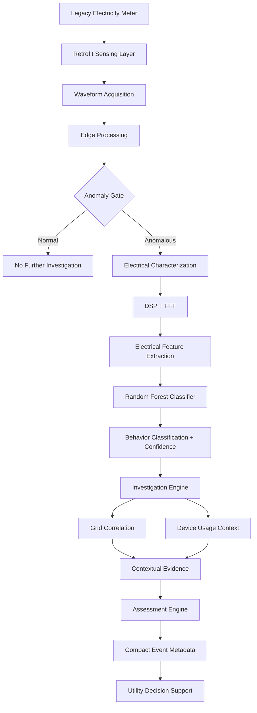

# VidyutSense

### Retrofit Edge Intelligence for Legacy Electricity Meters

> A retrofit edge-intelligence layer that brings waveform-level electrical intelligence to legacy electricity infrastructure — enabling local anomaly detection, electrical-behavior classification, contextual investigation, and compact decision-support events without requiring immediate smart-meter replacement or continuous cloud connectivity.

---

## The Problem

Electricity distribution networks increasingly depend on high-resolution metering, centralized analytics, and smart-grid infrastructure to understand abnormal electrical behavior.

However, many existing networks still contain legacy meters that provide limited visibility into the underlying electrical waveform.

This creates an infrastructure gap:

**How can we add electrical intelligence to legacy infrastructure without replacing the meter itself?**

A simple threshold-based system can detect that something changed:

```text
Measured Value > Threshold
        ↓
      ALERT
```

But an electrical anomaly does not automatically explain its cause.

A deviation may be associated with:

- Legitimate high-load operation
- Motor or compressor transients
- Harmonic distortion
- Unusual consumption behavior
- Sensor or measurement anomalies
- A potentially suspicious electrical condition
- A broader grid-side disturbance

Therefore, VidyutSense is designed around a more useful question:

> **Instead of immediately labeling an anomaly, can we progressively investigate what may be causing it?**

---

# Our Solution

**VidyutSense** is a retrofit sensing and edge-intelligence architecture for legacy electricity meters.

The system captures electrical waveform information, processes it locally, extracts an interpretable electrical signature, classifies the observed behavior, and then performs contextual investigation before producing a final decision-support assessment.

The core reasoning flow is:

```text
Sense
  ↓
Detect
  ↓
Characterize
  ↓
Investigate
  ↓
Correlate / Attribute
  ↓
Assess
  ↓
Report
```

The key design principle is:

> **VidyutSense doesn't immediately label an anomaly. It progressively investigates it.**

---

# System Architecture



---

# The Progressive Investigation Pipeline

VidyutSense is structured as a sequence of increasingly informative questions.

## Level 1 — Detect

### "Does the received waveform require further investigation?"

The first stage uses a deterministic anomaly gate.

It examines extracted electrical features against configurable prototype thresholds.

Current prototype indicators include:

- THD
- Transient score
- Crest factor

If the waveform remains within the configured baseline:

```text
WAVEFORM
   ↓
ANOMALY CHECK
   ↓
NORMAL
   ↓
NO FURTHER INVESTIGATION
```

If the waveform deviates sufficiently:

```text
WAVEFORM
   ↓
ANOMALY CHECK
   ↓
ANOMALOUS
   ↓
CHARACTERIZE
```

This first stage is intentionally transparent and does **not** use machine learning.

The thresholds are configurable prototype/demo values and are not claimed to be utility-calibrated operating limits.

---

# Level 2 — Characterize

### "What electrical behavior is actually occurring?"

Once an anomaly is detected, VidyutSense processes the waveform to extract an interpretable electrical signature.

The current signal-processing pipeline includes:

```text
Waveform
   ↓
Preprocessing
   ↓
FFT
   ↓
Harmonic Analysis
   ↓
Feature Extraction
   ↓
Electrical Signature
```

Current extracted features include:

- RMS
- Peak magnitude
- Crest factor
- Mean
- Standard deviation
- Fundamental magnitude
- 2nd harmonic magnitude
- 3rd harmonic magnitude
- 5th harmonic magnitude
- 7th harmonic magnitude
- Total Harmonic Distortion (THD)
- Transient score

These features form a compact representation of the observed electrical behavior.

---

# Why FFT?

The Fast Fourier Transform converts the signal from the **time domain** into the **frequency domain**.

```text
Time Domain
    ↓
    FFT
    ↓
Frequency Domain
```

The time-domain waveform shows how the electrical signal changes over time.

The frequency-domain representation helps identify:

- Fundamental frequency
- Harmonic components
- Distortion
- Frequency-domain abnormalities

For VidyutSense, harmonic information and THD become part of the electrical signature supplied to the classifier.

---

# Level 3 — Classify

### "What type of electrical behavior does the signature resemble?"

The current prototype uses a lightweight **Random Forest classifier** operating on the extracted feature vector.

The classifier currently distinguishes between controlled synthetic electrical-behavior classes:

1. `NORMAL`
2. `LEGITIMATE_HIGH_LOAD`
3. `HARMONIC_DISTORTION`
4. `TRANSIENT_EVENT`
5. `CONTROLLED_ANOMALOUS`

The model operates on extracted features rather than requiring continuous raw-waveform transmission.

This provides:

- Interpretable feature-based inference
- Low computational complexity
- Fast classification
- Compatibility with edge deployment
- Reduced communication requirements

---

# Current Prototype Performance

The current classifier achieved:

```text
Accuracy:        95.21%
Macro Precision: 95.57%
Macro Recall:    95.26%
Macro F1:        95.23%
```

These results were obtained on a **held-out controlled synthetic test dataset** generated specifically for the prototype.

### Important limitation

These numbers represent **controlled synthetic electrical-behavior classification performance**.

They are **not**:

- Real-world electricity-theft detection accuracy
- Utility-field accuracy
- Proof of tampering
- Evidence that the model generalizes to real electrical networks

Real deployment would require representative utility waveform datasets, calibration, extensive field validation, and testing across different meters, loads, environments, and grid conditions.

---

# Level 4 — Investigate

### "What evidence could explain the observed electrical behavior?"

Classification alone does not necessarily explain why an anomaly occurred.

Therefore, after characterization, VidyutSense moves into a contextual investigation layer.

The investigation engine can recommend a next investigation path based on the observed behavior.

```text
CLASSIFICATION
      ↓
INVESTIGATION ENGINE
      ↓
 ┌───────────────┐
 │ Recommended   │
 │ Next Check    │
 └───────┬───────┘
         ↓
 ┌───────────────────────┐
 │                       │
 ↓                       ↓
GRID CONTEXT       DEVICE CONTEXT
```

The operator can run the recommended investigation or select another available investigation path during the interactive demonstration.

---

# Level 5A — Grid Correlation

### "Is the anomaly isolated or correlated with surrounding nodes?"

VidyutSense can simulate a local neighborhood consisting of multiple household/meter nodes.

The prototype can evaluate the target meter alongside **10 neighboring nodes**.

### Example: Isolated anomaly

```text
Target:      ANOMALOUS
Neighbor 1:  NORMAL
Neighbor 2:  NORMAL
Neighbor 3:  NORMAL
...
Neighbor 10: NORMAL
```

Result:

```text
ANOMALY APPEARS ISOLATED
```

### Example: Correlated condition

```text
Target:      ANOMALOUS
Neighbor 1:  ANOMALOUS
Neighbor 2:  ANOMALOUS
Neighbor 3:  NORMAL
Neighbor 4:  ANOMALOUS
...
```

Result:

```text
MULTIPLE NEIGHBORING NODES SHOW
CORRELATED BEHAVIOR

Possible grid-side condition
```

Correlation does not prove a particular cause.

It provides additional context that can help distinguish an isolated event from a broader electrical condition.

---

# Level 5B — Device Usage Context

### "Could legitimate device activity explain the observed behavior?"

The system can also simulate device-level or high-load activity.

Example:

```text
Device A     NORMAL
Device B     HIGH USAGE
Device C     NORMAL
Device D     NORMAL
```

The observed electrical behavior can then be compared with the simulated usage context.

Possible result:

```text
USAGE PATTERN CONSISTENT WITH
ELEVATED LEGITIMATE DEMAND
```

or:

```text
OBSERVED BEHAVIOR NOT EXPLAINED
BY SIMULATED DEVICE ACTIVITY
```

This layer is contextual evidence, not proof of wrongdoing.

---

# Level 6 — Assessment

After the available evidence is gathered, the assessment engine combines:

- Anomaly-gate result
- Electrical behavior classification
- Classification confidence
- Grid correlation
- Device-usage context

The system then produces a decision-support assessment.

Possible outcomes include:

```text
NO FURTHER ACTION
```

```text
LIKELY LEGITIMATE HIGH USAGE
```

```text
POSSIBLE GRID-SIDE CONDITION
```

```text
FLAG FOR FURTHER INVESTIGATION
```

The system deliberately avoids producing:

```text
THEFT CONFIRMED
```

because waveform-level evidence and a prototype classifier cannot independently establish real-world theft.

---

# Level 7 — Report

Rather than continuously transmitting raw waveform data, the edge layer can generate a compact event representation.

Example:

```json
{
    "signal_status": "ANOMALOUS",
    "behavior_class": "HARMONIC_DISTORTION",
    "confidence": 0.99,
    "investigation_required": true,
    "next_investigation": "GRID_CORRELATION"
}
```

The conceptual communication model is:

```text
Raw Waveform
     ↓
Edge Processing
     ↓
Electrical Signature
     ↓
Classification
     ↓
Contextual Investigation
     ↓
Compact Event
     ↓
Utility
```

This reduces the need to continuously transmit high-volume raw waveform data.

---

# Technical Pipeline

The current software prototype follows:

```text
Synthetic Electrical Waveform
          ↓
Preprocessing
          ↓
FFT Analysis
          ↓
Feature Extraction
          ↓
Anomaly Gate
          ↓
Random Forest Classification
          ↓
Investigation Engine
          ↓
Grid / Device Context
          ↓
Assessment
          ↓
Compact Event
```

---

# Current Software Prototype

The interactive simulation demonstrates the processing and investigation concept without requiring a live electrical distribution network.

The current interface provides:

- Scenario selection
- Electrical waveform visualization
- FFT visualization
- Electrical signature display
- ML classification
- Classification confidence
- Event-level output
- Progressive investigation architecture

The simulation is intended to demonstrate the **system architecture and reasoning flow**, not to reproduce a utility network with physical accuracy.

---

# Controlled Signal Generation

Because representative utility waveform datasets are not currently available for this prototype, VidyutSense uses controlled synthetic waveforms.

The generator introduces controlled variation in:

- Amplitude
- Harmonic content
- Noise
- Transient behavior
- Signal distortion
- Waveform asymmetry

The synthetic dataset contains five experimental behavior classes:

```text
NORMAL
LEGITIMATE_HIGH_LOAD
HARMONIC_DISTORTION
TRANSIENT_EVENT
CONTROLLED_ANOMALOUS
```

These classes are designed for software experimentation and demonstration.

They are **not claimed to be direct representations of real-world electricity-theft signatures**.

---

# Edge Intelligence Philosophy

VidyutSense follows an **edge-first** architecture.

Instead of:

```text
Sensor
  ↓
Raw Data
  ↓
Cloud
  ↓
Heavy Processing
  ↓
Decision
```

the target architecture is:

```text
Sensor
  ↓
Local Processing
  ↓
Electrical Signature
  ↓
Local Classification
  ↓
Contextual Investigation
  ↓
Compact Event
  ↓
Utility System
```

This can provide:

- Lower communication bandwidth
- Reduced dependence on continuous connectivity
- Faster local response
- More privacy-friendly signal handling
- Better suitability for retrofit deployments
- Reduced need for continuous raw-waveform transmission

---

# Target Hardware Architecture

The eventual physical prototype is intended to use a safe, isolated, low-voltage experimental signal path.

Conceptually:

```text
Controlled Electrical Signal
          ↓
Non-invasive / Isolated Sensing
          ↓
Signal Conditioning
          ↓
ADC
          ↓
Edge MCU
          ↓
DSP
          ↓
Feature Extraction
          ↓
Lightweight Classifier
          ↓
Compact Event
          ↓
Local Display / Communication
```

A microcontroller such as an ESP32 can serve as a candidate edge-computing platform for the physical prototype.

The hardware stage will be demonstrated using safe low-voltage/isolated experimental signals rather than exposed mains connections.

---

# Why Retrofit?

Replacing legacy metering infrastructure across an entire distribution network can be expensive and operationally difficult.

VidyutSense explores an alternative approach:

```text
Existing Legacy Infrastructure
             +
     Retrofit Intelligence
             ↓
   Improved Electrical Visibility
```

The objective is not to replace the utility meter.

The objective is to add an intelligence layer around existing infrastructure.

---

# Why Edge-First?

Continuous transmission of raw electrical waveforms can create unnecessary communication and infrastructure requirements.

VidyutSense instead aims to perform the computationally useful steps locally:

```text
Waveform
   ↓
DSP
   ↓
Features
   ↓
Classification
   ↓
Context
   ↓
Event
```

Only meaningful event-level information needs to be communicated upstream.

This makes the architecture potentially suitable for environments with:

- Limited connectivity
- Large numbers of legacy meters
- Bandwidth constraints
- Distributed sensing requirements

---

# What Makes VidyutSense Different?

VidyutSense does **not** claim to invent:

- FFT-based electrical analysis
- Harmonic analysis
- Machine learning for electricity-related anomaly detection
- Electricity-theft detection
- Smart metering

These are established areas of research.

The focus of VidyutSense is the combination of:

### 1. Retrofit-first architecture

Extend legacy infrastructure rather than requiring immediate meter replacement.

### 2. Edge-first processing

Perform waveform processing and feature extraction locally.

### 3. Waveform-level intelligence

Work with electrical signal characteristics rather than relying exclusively on aggregate consumption history.

### 4. Progressive investigation

Do not immediately convert an anomaly into an accusation.

```text
Detect
  ↓
Characterize
  ↓
Investigate
  ↓
Correlate / Attribute
  ↓
Assess
```

### 5. Context-aware decision support

Use surrounding grid behavior and simulated device context to provide additional evidence.

### 6. Event-level communication

Transmit compact information instead of continuously sending raw waveform data.

---

# Repository Structure

```text
VidyutSense/
│
├── docs/
│
├── hardware/
│
├── signal_processing/
│   ├── src/
│   │   ├── waveform_generator.py
│   │   ├── preprocessing.py
│   │   ├── fft_analysis.py
│   │   └── feature_extraction.py
│   └── tests/
│
├── ml/
│   ├── src/
│   │   ├── generate_dataset.py
│   │   └── train_classifier.py
│   ├── data/
│   └── models/
│
├── simulation/
│   ├── app.py
│   ├── anomalygate.py
│   ├── investigation_engine.py
│   ├── grid_simulator.py
│   ├── device_simulator.py
│   └── assessment_engine.py
│
├── run_demo.py
├── requirements.txt
└── README.md
```

---

# Running the Prototype

## 1. Clone the repository

```bash
git clone https://github.com/hinox4593/VidyutSense.git
cd VidyutSense
```

## 2. Install dependencies

```bash
pip install -r requirements.txt
```

## 3. Run the interactive simulation

```bash
python simulation/app.py
```

## 4. Run the command-line demonstration

```bash
python run_demo.py
```

---

# Model Training

The synthetic dataset can be generated using:

```bash
python ml/src/generate_dataset.py
```

The classifier can then be trained using:

```bash
python ml/src/train_classifier.py
```

The trained model and evaluation artifacts are stored under:

```text
ml/models/
```

---

# Validation

The prototype currently evaluates the classification pipeline using:

- Accuracy
- Precision
- Recall
- F1-score
- Confusion matrix
- Feature importance

Additional deployment-oriented metrics include:

- False-positive rate
- Inference latency
- Communication payload size
- Computational requirements

The current model result of approximately **95.2% accuracy** should be interpreted only within the controlled synthetic dataset used for the prototype.

---

# Scalability

The architecture is designed around distributed edge intelligence.

Instead of moving all raw waveform data to a centralized system:

```text
             ┌── Edge Node 1
             │
             ├── Edge Node 2
             │
Meters ──────┼── Edge Node 3
             │
             ├── Edge Node 4
             │
             └── Edge Node N
                    ↓
             Compact Events
                    ↓
              Utility Layer
```

Each retrofit node can locally perform:

- Signal acquisition
- DSP
- Feature extraction
- Classification
- Initial anomaly investigation

Only compact event information needs to move to the higher-level utility system.

This architecture can potentially support large numbers of distributed legacy-meter nodes without requiring continuous raw-waveform streaming from every location.

---

# Target Users

### Primary

**Electricity distribution companies / DISCOMs**

Potential applications include:

- Electrical anomaly screening
- Legacy infrastructure monitoring
- Investigation prioritization
- Distribution-network visibility
- Event-level operational intelligence

### Future Ecosystem

The architecture could potentially integrate with:

- Distribution monitoring platforms
- Smart-grid systems
- Utility analytics platforms
- Edge gateways
- Advanced metering infrastructure

---

# Sustainability & Impact

## SDG 7 — Affordable & Clean Energy

Improved visibility into electrical behavior can help utilities understand abnormal conditions and investigate avoidable losses more efficiently.

## SDG 9 — Industry, Innovation & Infrastructure

VidyutSense explores how legacy infrastructure can be augmented with intelligent sensing rather than requiring immediate replacement.

The broader goal is:

> **Make existing electrical infrastructure more observable and intelligent.**

---

# Limitations

VidyutSense is currently a prototype demonstrating an edge electrical-intelligence architecture.

The present system has several important limitations:

- Synthetic waveforms are used for software validation.
- The current classes are controlled experimental categories.
- Prototype anomaly thresholds are not utility-calibrated.
- The classifier has not yet been validated on representative utility field data.
- Grid and device investigations are simulated.
- The current prototype does not prove electricity theft.
- The system does not autonomously accuse a consumer of theft.
- Real-world deployment would require extensive calibration and field validation.

A production deployment would additionally require consideration of:

- Meter-to-meter variability
- Sensor calibration
- Environmental effects
- Electrical safety
- Cybersecurity
- Data privacy
- Regulatory requirements
- Communication reliability
- Model drift
- Utility integration
- Large-scale field validation

---

# Roadmap

## Phase 1 — Signal Processing

- Synthetic waveform generation
- Signal preprocessing
- FFT analysis
- Harmonic extraction
- Electrical feature extraction

**Status: Implemented**

---

## Phase 2 — Edge Classification

- Feature-vector generation
- Random Forest classifier
- Controlled synthetic dataset
- Model evaluation
- Classification confidence

**Status: Implemented**

---

## Phase 3 — Deterministic Anomaly Gate

- Transparent anomaly screening
- Configurable thresholds
- Explainable anomaly reasons
- Separation of detection and classification

**Status: Implemented**

---

## Phase 4 — Interactive Investigation Layer

- Progressive investigation flow
- Investigation recommendation
- Grid correlation simulation
- Device usage simulation
- Context-aware assessment

**Status: In Development**

---

## Phase 5 — Physical Edge Prototype

- Safe low-voltage experimental sensing
- Signal conditioning
- ADC acquisition
- MCU-based processing
- Local feature extraction
- Edge inference
- Local event display

**Status: Planned**

---

## Phase 6 — Real-World Validation

- Representative utility waveform datasets
- Real load characterization
- Field calibration
- Cross-meter validation
- False-positive analysis
- Larger-scale deployment testing

**Status: Future**

---

# Vision

## From Legacy Meters to Intelligent Grid Nodes

VidyutSense aims to bridge the gap between conventional electricity infrastructure and intelligent distribution networks.

The long-term vision is:

```text
Legacy Meter
     ↓
Retrofit Sensing
     ↓
Edge Intelligence
     ↓
Local Understanding
     ↓
Contextual Investigation
     ↓
Utility Decision Support
```

Not every anomaly needs an immediate accusation.

Sometimes the right answer is:

```text
Normal
```

Sometimes:

```text
Likely Legitimate High Usage
```

Sometimes:

```text
Possible Grid-Side Condition
```

And sometimes:

```text
Flag for Further Investigation
```

The goal is to make the system **more informative before it becomes more assertive.**

---

# Core Philosophy

```text
SEE
 ↓
UNDERSTAND
 ↓
CLASSIFY
 ↓
INVESTIGATE
 ↓
CORRELATE
 ↓
ASSESS
 ↓
ACT
```

> **VidyutSense — Detect the anomaly. Understand the behavior. Investigate the context. Support the decision.**

---

# Team

- Guru Sekhar
- B. Danuj Kumar
- N. Akshaya
- S. Yashika
- Adithya

---

# Status

**Hackathon Prototype — Investigation Layer in Development**

The current repository contains the signal-processing pipeline, feature extraction, machine-learning classification, deterministic anomaly screening, and interactive simulation components.

The next stage is integrating the complete contextual investigation and assessment flow with the physical edge prototype.
