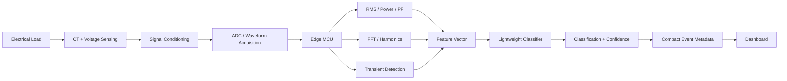

[README.md](https://github.com/user-attachments/files/31859090/README.md)
#  VidyutSense

### Retrofit Edge Intelligence for Legacy Electricity Meters

> A low-cost retrofit sensing layer that brings real-time waveform intelligence to legacy electricity infrastructure — without requiring a smart-meter upgrade or continuous cloud connectivity.

---

##  The Problem

Modern electricity anomaly and non-technical-loss detection increasingly relies on smart-meter infrastructure, historical consumption data, and centralized analytics.

But many existing distribution networks still contain legacy meters that do not expose high-resolution electrical waveform data.

This creates an infrastructure gap:

**How can we add electrical intelligence without replacing the meter?**

---

##  Our Solution

VidyutSense is a retrofit sensing and edge-intelligence platform that captures electrical waveforms, extracts meaningful electrical signatures locally, and performs lightweight classification at the edge.

Instead of continuously sending raw electrical data to the cloud, VidyutSense processes the signal locally and transmits only compact event metadata.

### Legacy Meter
↓
### Retrofit Sensor
↓
### Waveform Acquisition
↓
### Edge DSP
↓
### Electrical Signature
↓
### Lightweight Classification
↓
### Event + Confidence
↓
### Dashboard

---

##  What Makes VidyutSense Different?

VidyutSense does not claim to reinvent electricity-theft detection, FFT-based analysis, or machine learning.

Our focus is the **infrastructure and deployment gap**:

> Bringing waveform-level, edge-based electrical intelligence to legacy meters without requiring full smart-meter/AMI deployment or continuous cloud connectivity.

### Key Design Principles

- **Retrofit-first** — designed to extend existing infrastructure
- **Edge-first** — process electrical signals locally
- **Low-bandwidth** — transmit compact event metadata rather than continuous raw waveforms
- **ECE-native** — combines sensing, signal processing, embedded systems and lightweight AI
- **Decision-support** — identifies anomalous behavior without making an autonomous accusation

##  From Anomaly Detection to Cause-Aware Intelligence

A simple threshold-based system can produce:

Current > Threshold → ALERT

But an abnormal electrical event does not necessarily indicate suspicious behavior.

It may represent:

- Legitimate high-load operation
- Motor or compressor transients
- Unusual consumption behavior
- Sensor or measurement anomalies
- Suspicious electrical signatures

VidyutSense therefore aims to move from:

**"Is something abnormal?"**

to:

**"What is the likely nature of the abnormal behavior?"**

The prototype will explore controlled classification between:

1. Normal behavior
2. Legitimate abnormal/high-load behavior
3. Suspicious/anomalous electrical signatures

## ⚙️ System Architecture

### Processing Flow

**Sense → Sample → Process → Extract → Classify → Transmit → Act**

- **Sensing:** Capture electrical behavior using non-invasive current and isolated voltage sensing.
- **Edge DSP:** Extract RMS, power, power factor, harmonic and transient features locally.
- **Edge AI:** Classify the resulting electrical signature using a lightweight model.
- **Communication:** Transmit compact event metadata instead of continuously sending raw waveforms.
- **Dashboard:** Display event classification, confidence and relevant diagnostic features.

---

##  Signal Processing

The edge processing pipeline is designed to extract interpretable electrical features from the acquired waveform.

Potential features include:

- RMS voltage/current
- Active and apparent power
- Power factor
- Frequency-domain components
- Harmonic content
- Transient characteristics

These features form an electrical signature that can be supplied to a lightweight classifier.

##  Edge AI

VidyutSense is intentionally designed around lightweight models rather than large cloud-dependent models.

Candidate approaches include:

- Decision Trees
- Support Vector Machines
- Small Neural Networks

The model operates on extracted electrical features rather than requiring continuous raw-waveform transmission.

This enables:

- Low-latency inference
- Reduced communication bandwidth
- Lower dependence on connectivity
- Edge-based operation

##  Validation Strategy

The initial prototype will be validated using a controlled, safe laboratory setup.

The dataset will contain controlled electrical conditions representing:

- Normal operation
- Legitimate abnormal/high-load events
- Controlled anomalous electrical signatures

We will compare VidyutSense against a simple threshold-based baseline.

### Evaluation Metrics

- Accuracy
- Precision
- Recall
- F1-score
- False-positive rate
- Classification latency
- Data transmitted

We will not claim real-world theft-detection performance without utility field data.

Real-world deployment would require validation using genuine utility datasets.

##  Sustainability & Impact

### SDG 7 — Affordable & Clean Energy

Improving visibility into electrical behavior can support more efficient utilization of existing distribution infrastructure and help utilities investigate avoidable losses.

### SDG 9 — Industry, Innovation & Infrastructure

VidyutSense extends intelligence to legacy infrastructure rather than requiring immediate replacement with fully smart infrastructure.

### Target Users

Electricity distribution companies / DISCOMs

### Potential Value

A retrofit sensing layer that can bridge the gap between conventional meters and future intelligent distribution infrastructure.
##  Development Roadmap

### Phase 1 — Prototype
Safe low-voltage sensing + waveform acquisition

### Phase 2 — Edge DSP
RMS, power factor, FFT, harmonics and transient extraction

### Phase 3 — Classification
Lightweight feature-based anomaly classification

### Phase 4 — Dashboard
Event visualization, confidence and diagnostic features

### Phase 5 — Validation
Controlled experiments and baseline comparison

### Future
Utility field validation, larger datasets and deployment-scale integration

##  Scope & Limitations

VidyutSense is a prototype for controlled electrical-signal analysis.

The system does not claim to prove electricity theft or identify real-world tampering from laboratory data alone.

The prototype will focus on demonstrating electrical signature acquisition, feature extraction and controlled anomaly discrimination.

Deployment in utility environments would require extensive field validation, calibration, cybersecurity, regulatory approval and integration with existing infrastructure.

---

##  Vision

### From Legacy Meters to Intelligent Grid Nodes

VidyutSense aims to provide a practical bridge between conventional electrical infrastructure and the intelligent distribution networks of the future.

**Sense → Process → Understand → Act**

---

##  Team

[Guru Sekhar]  
[B.Danuj Kumar]  
[N.Akshaya]  
[S.Yashika]
[Adithya]

---

##  Status

**Hackathon Prototype — In Development**

