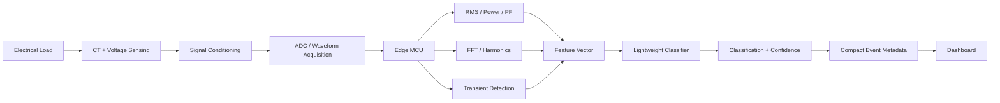

# System Architecture

## Overview

VidyutSense is designed as a retrofit sensing and edge-intelligence layer for legacy electricity infrastructure.

The system converts electrical measurements into locally processed features, performs lightweight classification, and transmits compact event information.

## High-Level Architecture

## 1. Electrical Sensing

The sensing layer captures electrical behavior using non-invasive current sensing and appropriately isolated voltage sensing.

The sensing stage converts electrical behavior into measurable signals that can be processed digitally.

## 2. Signal Conditioning

The acquired signals are conditioned for suitable ADC acquisition while maintaining appropriate measurement and safety characteristics.

## 3. Waveform Acquisition

An ADC samples the conditioned signal and converts it into a digital waveform for processing.

Sampling parameters will be selected according to the electrical-frequency and transient information required.

## 4. Edge Processing

The edge MCU performs local signal processing.

Potential processing includes:

- RMS voltage and current
- Active and apparent power
- Power factor
- Frequency-domain analysis
- Harmonic feature extraction
- Transient characterization

## 5. Electrical Feature Vector

The extracted measurements are combined into a feature representation of the observed electrical behavior.

This feature vector forms the input to the classification stage.

## 6. Edge Classification

A lightweight model operates on the extracted electrical features.

Candidate approaches include:

- Decision Tree
- Support Vector Machine
- Small Neural Network

The final model will be selected based on experimental performance and edge-resource requirements.

## 7. Event Output

The system produces:

- Event classification
- Confidence
- Relevant diagnostic features
- Event metadata

The output is intended as decision support rather than an autonomous accusation of theft.

## 8. Communication

The edge node transmits compact event metadata instead of continuously transmitting high-frequency raw waveforms.

This is intended to reduce communication requirements and dependence on continuous connectivity.

## 9. Dashboard

The dashboard provides a technician-oriented view of detected events and relevant diagnostic information.

## Design Principle

**Sense → Process → Understand → Communicate**

The intelligence begins at the physical electrical signal rather than depending entirely on centralized cloud analysis.
