# System Architecture

## Overview

VidyutSense is designed as a **retrofit-oriented sensing and edge-intelligence layer for legacy electricity infrastructure**.

The architecture begins with an electrical waveform and progressively converts it into:

1. A signal-level anomaly decision
2. An electrical behavior characterization
3. A behavior classification
4. Contextual investigation
5. A decision-support assessment
6. A compact event for the utility layer

The central architectural principle is:

> **The system does not immediately label an anomaly. It progressively investigates it.**

---

# High-Level Architecture

```mermaid
flowchart LR
    A[Electrical Signal] --> B[Sensing]
    B --> C[Signal Conditioning]
    C --> D[ADC / Waveform Acquisition]
    D --> E[Edge Processing]

    E --> F[Feature Extraction]
    F --> G[Deterministic Anomaly Gate]

    G -->|NORMAL| Z[No Further Investigation]
    G -->|ANOMALOUS| H[Electrical Characterization]

    H --> I[FFT / Harmonics]
    H --> J[Electrical Signature]
    J --> K[Random Forest Classification]
    K --> L[Behavior + Confidence]

    L --> M[Investigation Engine]

    M --> N[Grid Context]
    M --> O[Device Context]

    N --> P[10-House Correlation]
    O --> Q[Spatial Device Association]

    P --> R[Contextual Assessment]
    Q --> R

    R --> S[Compact Event]
    S --> T[Utility / Dashboard]
```



---

# Architectural Reasoning Flow

The system can be understood as a sequence of questions:

```text
1. IS SOMETHING WRONG?
          ↓
2. WHAT ELECTRICAL BEHAVIOR IS OCCURRING?
          ↓
3. WHAT COULD EXPLAIN IT?
          ↓
4. IS THE BEHAVIOR LOCAL OR CORRELATED?
          ↓
5. CAN DEVICE ACTIVITY EXPLAIN IT?
          ↓
6. WHAT SHOULD THE UTILITY CONSIDER?
```

This creates the overall reasoning chain:

```text
DETECT
  ↓
CHARACTERIZE
  ↓
CLASSIFY
  ↓
INVESTIGATE
  ↓
CORRELATE / ATTRIBUTE
  ↓
ASSESS
```

---

# 1. Electrical Sensing

The target architecture begins with electrical sensing around existing metering infrastructure.

The intended sensing layer uses:

- Non-invasive current sensing
- Appropriately isolated voltage sensing
- Suitable signal conditioning

The purpose is to obtain electrical information without requiring immediate replacement of the legacy meter itself.

The current software prototype does not claim a completed field sensing implementation. Physical sensing remains a future hardware-validation stage.

---

# 2. Signal Conditioning

The sensed electrical signals must be conditioned for suitable digital acquisition.

The conditioning stage is responsible for preparing the signal for the ADC while maintaining appropriate measurement and safety characteristics.

A future physical implementation would select the conditioning and isolation approach according to the sensing hardware, ADC requirements and deployment environment.

---

# 3. Waveform Acquisition

An ADC samples the conditioned electrical signal and converts it into a digital waveform.

The acquired waveform becomes the input to the edge signal-processing pipeline.

Sampling parameters should be selected according to:

- Fundamental electrical frequency
- Harmonic content of interest
- Required transient resolution
- Computational constraints

The current software prototype uses controlled synthetic waveforms for demonstration.

---

# 4. Edge Processing

The edge-processing layer performs electrical signal analysis locally.

The current prototype includes:

- DC-offset preprocessing
- FFT analysis
- Harmonic analysis
- RMS calculation
- Crest-factor calculation
- THD calculation
- Transient characterization
- Electrical feature extraction

The objective is to convert a waveform into a compact representation of its electrical behavior.

Conceptually:

```text
Waveform
   ↓
Preprocessing
   ↓
Frequency / Time-Domain Analysis
   ↓
Electrical Features
   ↓
Electrical Signature
```

---

# 5. Deterministic Anomaly Gate

Before invoking contextual investigation, VidyutSense performs a transparent first-stage anomaly screening step.

The anomaly gate asks:

> **"Does this waveform show enough deviation to require further investigation?"**

The current prototype uses configurable deterministic limits for selected features, including:

- THD
- Transient score
- Crest factor

Conceptually:

```text
Electrical Features
       ↓
Anomaly Gate
   ↙         ↘
NORMAL     ANOMALOUS
  ↓            ↓
STOP       Continue
             ↓
        Characterize
```

This stage intentionally does **not** claim to identify electricity theft.

It is a screening mechanism that determines whether additional reasoning is warranted.

---

# 6. Electrical Characterization

When the anomaly gate indicates that further investigation is required, the system characterizes the observed waveform.

The characterization layer examines electrical features such as:

- RMS
- Peak value
- Crest factor
- Fundamental magnitude
- Harmonic magnitudes
- THD
- Transient score

FFT analysis is used to move from the time domain to frequency-domain information and expose harmonic characteristics.

The resulting feature representation is referred to as the **electrical signature**.

---

# 7. Electrical Behavior Classification

The current software prototype uses a **Random Forest classifier** operating on the extracted electrical feature vector.

The classifier predicts one of the controlled prototype behavior classes:

- `NORMAL`
- `LEGITIMATE_HIGH_LOAD`
- `HARMONIC_DISTORTION`
- `TRANSIENT_EVENT`
- `CONTROLLED_ANOMALOUS`

The classifier also produces a confidence value.

Important distinction:

> The model classifies controlled electrical behavior. It does not independently prove electricity theft.

The current model was trained and evaluated using a controlled synthetic dataset. Its reported accuracy should therefore be described as:

> **95.2% classification accuracy on a controlled synthetic held-out test dataset**

and not as real-world theft-detection accuracy.

---

# 8. Investigation Engine

Classification is not treated as the final answer.

After characterization and classification, the investigation engine asks:

> **"What contextual evidence could explain this behavior?"**

The investigation layer can branch into two contextual paths:

```text
                 Classified Anomaly
                        ↓
                Investigation Engine
                   ↙            ↘
          Grid Context       Device Context
```

The prototype is designed so that the next investigation can be selected according to the available evidence.

---

# 9. Grid Context Investigation

The grid investigation checks whether the target anomaly appears isolated or correlated with nearby electrical behavior.

The prototype simulates:

**10 household / meter nodes**

Each node can report:

```text
NORMAL
or
ANOMALOUS
```

The number of anomalous houses is divided by the total number of houses:

```text
Raw Correlation = Anomalous Houses / 10
```

The raw value is then rounded to the nearest 0.5 to produce the prototype **Grid Correlation Score**.

```text
0–2 anomalous houses   → 0.0 → LOW
3–7 anomalous houses   → 0.5 → MODERATE
8–10 anomalous houses  → 1.0 → HIGH
```

### Interpretation

**0.0 — LOW**

> Anomaly appears isolated.

**0.5 — MODERATE**

> Moderate correlation detected; grid-side influence is uncertain.

**1.0 — HIGH**

> Multiple neighboring meters show correlated behavior. Possible grid-side condition.

The score is a prototype contextual evidence measure.

It is **not a calibrated probability of grid damage, grid failure or theft**.

---

# 10. Device Context Investigation

When an anomaly appears primarily localized, the system can investigate simulated device activity inside the target house.

The prototype represents the house using:

- Simulated electrical devices
- Spatial activity nodes
- Normal-activity nodes
- High-activity nodes

The high-activity nodes are intentionally not placed directly on individual devices.

This allows the system to perform a simple spatial inference step.

Conceptually:

```text
High-Activity Node
        ↓
Measure Distance to Devices
        ↓
Compare Candidate Devices
        ↓
Nearest Device
        ↓
Association Confidence
```

For each candidate device, the prototype can calculate Euclidean distance:

```text
d = √((x_node - x_device)² + (y_node - y_device)²)
```

The nearest device becomes the most likely spatial association.

A relative proximity-based score can then indicate how strongly that device is associated with the observed node compared with the alternatives.

This is an **association confidence / evidence score**, not a calibrated causal probability.

---

# 11. Local Load and Energy Context

The device investigation can also estimate the effect of the associated device on electrical usage.

The prototype can represent:

- Baseline device load
- Current simulated load
- Load increase
- Event duration
- Estimated additional energy consumption

The energy estimate follows:

```text
Energy = Power × Time
```

For example, an additional simulated load of 1.2 kW sustained for 2 hours corresponds to:

```text
1.2 kW × 2 h = 2.4 kWh
```

Electricity consumption is commonly expressed in kWh, with one kWh corresponding to one billing unit under the common utility convention.

These values are simulation outputs and are not presented as measured field consumption.

---

# 12. Contextual Assessment

The final assessment combines the evidence collected during the investigation.

Possible prototype outcomes include:

```text
NO FURTHER ACTION
LIKELY LEGITIMATE HIGH USAGE
POSSIBLE GRID-SIDE CONDITION
FLAG FOR FURTHER INVESTIGATION
```

Example reasoning path:

```text
ANOMALY
   ↓
LOW GRID CORRELATION
   ↓
DEVICE INVESTIGATION
   ↓
HIGH-ACTIVITY NODE
   ↓
NEAREST DEVICE = AC
   ↓
HIGH ASSOCIATION CONFIDENCE
   ↓
ESTIMATED LOAD INCREASE
   ↓
LIKELY LEGITIMATE HIGH USAGE
```

Another path:

```text
ANOMALY
   ↓
HIGH GRID CORRELATION
   ↓
MULTIPLE NEIGHBORING METERS AFFECTED
   ↓
POSSIBLE GRID-SIDE CONDITION
```

Another possible outcome is:

```text
ANOMALY
   ↓
LOW GRID CORRELATION
   ↓
DEVICE ACTIVITY DOES NOT EXPLAIN IT
   ↓
FLAG FOR FURTHER INVESTIGATION
```

The architecture therefore avoids treating the initial anomaly as an automatic accusation.

---

# 13. Compact Event Generation

After contextual assessment, the edge system can generate a compact event representation.

A representative event can contain:

```text
Signal Status
Behavior Class
Classification Confidence
Relevant Electrical Features
Grid Correlation
Device Association
Estimated Load / Energy Context
Assessment
Source
Timestamp / Node Identifier
```

Conceptually:

```text
Raw Waveform
     ↓
Electrical Signature
     ↓
Behavior Classification
     ↓
Contextual Evidence
     ↓
Assessment
     ↓
Compact Event
```

This is the information intended to move toward a utility-facing system rather than continuous raw waveform data.

---

# 14. Communication Layer

The architecture is designed around event-level communication.

Instead of continuously transmitting high-frequency waveform samples, an edge node can communicate compact information when a relevant event occurs.

This can reduce:

- Communication bandwidth requirements
- Centralized processing load
- Dependence on continuous connectivity

The communication technology itself is not fixed by the prototype and can be selected according to deployment requirements.

---

# 15. Utility / Dashboard Layer

The utility-facing layer can present:

- Detected events
- Electrical behavior classification
- Confidence
- Contextual investigation results
- Grid correlation
- Device association
- Assessment
- Investigation priority

The dashboard is therefore intended to support **human investigation and decision-making**, rather than replace field judgment.

---

# 16. Prototype Architecture vs Target Architecture

It is important to distinguish what is demonstrated today from the intended future system.

### Current software prototype

```text
Controlled Synthetic Waveform
          ↓
Preprocessing
          ↓
FFT + Feature Extraction
          ↓
Deterministic Anomaly Gate
          ↓
Random Forest Classification
          ↓
Simulated Grid Context
          ↓
Simulated Device Context
          ↓
Decision-Support Assessment
          ↓
Compact Event
```

### Target hardware architecture

```text
Legacy Meter / Electrical System
          ↓
Non-Invasive Sensing
          ↓
Signal Conditioning + Isolation
          ↓
ADC
          ↓
Edge MCU
          ↓
DSP + Feature Extraction
          ↓
Anomaly Gate
          ↓
Lightweight Classification
          ↓
Contextual Investigation
          ↓
Compact Event
          ↓
Utility Layer
```

The current prototype demonstrates the reasoning and software architecture; sensing hardware and field validation remain future stages.

---

# Design Principles

## 1. Retrofit-First

The system is intended to augment existing infrastructure rather than require immediate replacement of legacy meters.

## 2. Edge-First

Electrical processing and lightweight classification are performed locally where practical.

## 3. Progressive Investigation

An anomaly is treated as the beginning of an investigation rather than the final conclusion.

## 4. Context Before Accusation

Grid-level and device-level evidence can be considered before producing a final assessment.

## 5. Event-Level Communication

The architecture aims to communicate compact, meaningful events rather than continuously transmit raw waveform data.

## 6. Decision Support

The system provides evidence and assessment to support utility investigation rather than autonomously declaring theft.

---

# Architectural Summary

The complete VidyutSense architecture can be summarized as:

```text
                  ELECTRICAL SIGNAL
                         ↓
                      SENSE
                         ↓
                       DSP
                         ↓
                 ANOMALY GATE
                    ↙       ↘
                NORMAL    ANOMALOUS
                  ↓           ↓
                 END     CHARACTERIZE
                              ↓
                         CLASSIFY
                              ↓
                       INVESTIGATION
                         ↙       ↘
                       GRID     DEVICE
                         ↓       ↓
                    CORRELATE  ASSOCIATE
                         ↘       ↙
                         ASSESS
                           ↓
                     COMPACT EVENT
                           ↓
                     UTILITY LAYER
```

> **Sense → Detect → Characterize → Classify → Investigate → Assess → Communicate**

The core architectural contribution is not any single signal-processing or machine-learning technique. It is the integration of **retrofit sensing, edge electrical intelligence and progressive contextual investigation** into one decision-support workflow for legacy electrical infrastructure.
