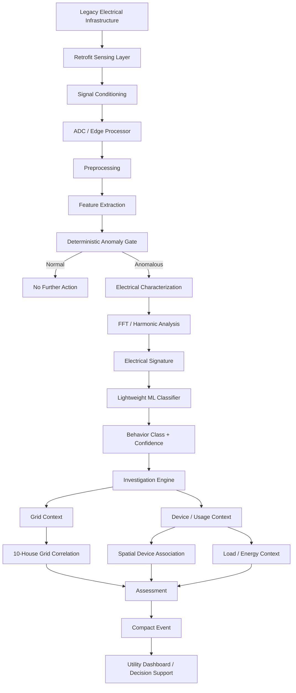

[VidyutSense_README.md](https://github.com/user-attachments/files/31870688/VidyutSense_README.md)
# VidyutSense

## Retrofit Edge Intelligence for Legacy Electricity Infrastructure

VidyutSense is a **retrofit-oriented edge-intelligence system for legacy electricity meters and electrical infrastructure**.

Instead of immediately replacing legacy infrastructure with a complete smart-meter/AMI rollout, VidyutSense explores how an additional sensing and intelligence layer can observe electrical behavior, process it locally, characterize anomalies, investigate their possible causes, and provide **decision-support information** to utility personnel.

> **VidyutSense doesn't immediately label an anomaly. It progressively investigates it.**

---

## 1. The Problem

Electrical infrastructure is not uniform. Utilities may operate environments containing a mixture of modern smart meters and older legacy equipment.

A legacy meter may provide useful consumption information while offering limited access to the waveform-level information needed for deeper electrical-behavior analysis.

More importantly, an abnormal electrical signature does **not automatically mean electricity theft or malicious activity**.

An observed anomaly could be caused by:

- legitimate high demand
- harmonic distortion
- a transient event
- a grid-side condition
- unusual but legitimate equipment behavior
- an unexplained localized electrical event

Therefore, simply detecting an anomaly is not enough.

The system should ask:

```text
Did something abnormal happen?
        ↓
What electrical behavior occurred?
        ↓
What could explain it?
        ↓
Does the surrounding grid show similar behavior?
        ↓
Does local device usage explain it?
        ↓
What should the utility investigate?
```

---

# 2. Our Approach

VidyutSense uses a **progressive investigation pipeline**:

```text
SENSE
  ↓
DETECT
  ↓
CHARACTERIZE
  ↓
CLASSIFY
  ↓
INVESTIGATE
  ↓
CORRELATE / ATTRIBUTE
  ↓
ASSESS
  ↓
UTILITY DECISION SUPPORT
```

The key idea is that later stages are triggered by evidence from earlier stages.

The system therefore does not treat every anomaly as the same event.

---

# 3. High-Level Architecture



---

# 4. What Makes VidyutSense Different?

The individual technologies used in VidyutSense are not claimed to be novel by themselves.

FFT, harmonic analysis, machine learning, electrical sensing, IoT communication, and retrofit monitoring are established engineering techniques.

The proposed contribution is their **combination into a progressive, retrofit-oriented investigation workflow**.

### Core differentiators

### 1. Retrofit-first

The target deployment does not assume that every existing meter or electrical installation must immediately be replaced.

Instead, VidyutSense is designed around the idea of adding intelligence around existing infrastructure.

### 2. Edge-first

Waveform processing and first-stage analysis are intended to happen close to the measurement point.

Rather than continuously transmitting raw waveform data, the edge system can generate a compact event containing the important information.

### 3. Waveform-level electrical intelligence

The system goes beyond a simple energy-consumption value.

It extracts electrical characteristics such as:

- RMS
- peak value
- crest factor
- fundamental magnitude
- harmonic magnitudes
- THD
- transient characteristics

### 4. Progressive investigation

An anomaly is not immediately interpreted as a fault or suspicious activity.

The system progressively gathers evidence:

```text
Anomaly
   ↓
Electrical behavior
   ↓
Grid context
   ↓
Device / usage context
   ↓
Assessment
```

### 5. Decision support rather than autonomous accusation

The system does not claim to prove electricity theft.

Its purpose is to provide evidence that can help a utility decide whether an event:

- requires no further action
- is likely legitimate high usage
- may be grid-side
- requires further investigation

---

# 5. Research Foundation: Retrofit Is Feasible

A particularly relevant prior work is:

**Fernandes et al., "A Retrofit Strategy for Real-Time Monitoring of Building Electrical Circuits Based on the SmartLVGrid Metamodel," Energies, 2022, 15, 9234.**

DOI:

https://doi.org/10.3390/en15239234

The paper demonstrates a retrofit strategy for monitoring electrical parameters in an existing low-voltage building installation.

The authors developed embedded retrofit hardware and a cloud supervisory system while preserving existing electrical infrastructure. Their system monitored quantities including voltage, current, active power, reactive power, apparent power, and power factor.

The work is important to VidyutSense because it establishes a practical precedent for:

```text
Legacy electrical infrastructure
        ↓
Retrofit monitoring hardware
        ↓
Electrical measurement
        ↓
Embedded processing
        ↓
Communication
        ↓
Supervisory system
```

The paper also describes an ESP32-based embedded architecture, current-transformer-based sensing, and a retrofit module positioned alongside existing circuit breakers.

### What VidyutSense does differently

The paper primarily focuses on **real-time electrical-parameter monitoring and energy management through retrofit infrastructure**.

VidyutSense proposes extending this direction with an additional intelligence layer:

```text
Retrofit sensing
      ↓
Waveform acquisition
      ↓
DSP
      ↓
Electrical signature
      ↓
Anomaly gate
      ↓
ML behavior classification
      ↓
Contextual investigation
      ↓
Decision support
```

Therefore:

> **Retrofit is the deployment foundation. Progressive edge intelligence is the VidyutSense contribution.**

We do not claim that retrofit monitoring itself is new.

---

# 6. The VidyutSense Intelligence Layers

## Layer 1 — Deterministic Anomaly Gate

First question:

> **"Does the received waveform show enough deviation from expected behavior to require further investigation?"**

This stage is intentionally transparent and rule-based.

Current prototype thresholds include:

- THD
- transient score
- crest factor

Example:

```text
THD > threshold
      OR
Transient score > threshold
      OR
Crest factor > threshold

            ↓

        ANOMALOUS
```

If no threshold is exceeded:

```text
NORMAL
  ↓
No further investigation
```

This stage does **not** use machine learning.

---

# 7. Layer 2 — Electrical Characterization

If the anomaly gate is triggered, VidyutSense characterizes the electrical behavior.

## Signal Processing Pipeline

```text
Synthetic / future sensed waveform
          ↓
DC offset removal
          ↓
Feature extraction
          ↓
FFT
          ↓
Harmonic analysis
          ↓
THD / transient analysis
          ↓
Electrical signature
```

The prototype operates on 50 Hz electrical waveforms.

Current synthetic demonstration signals use:

- 5000 Hz sample rate
- 0.2 second waveform duration
- 10 cycles of the 50 Hz fundamental

---

# 8. Electrical Signature

The prototype extracts a feature vector containing:

```text
RMS
Peak
Crest Factor
Mean
Standard Deviation
Fundamental Magnitude
2nd Harmonic
3rd Harmonic
5th Harmonic
7th Harmonic
THD
Transient Score
```

These values form the electrical signature used by the classifier.

### Why FFT?

The raw waveform is represented in the time domain.

FFT provides a frequency-domain representation that makes harmonic content easier to quantify.

For example:

```text
Time Domain
    ↓
    waveform shape

FFT
    ↓
Frequency Domain
    ↓
Fundamental + Harmonics
    ↓
Electrical Signature
```

This enables the system to distinguish different types of electrical behavior using multiple characteristics rather than a single threshold.

---

# 9. Layer 3 — Lightweight Machine Learning

The current prototype uses a **Random Forest classifier**.

The classifier receives the extracted electrical signature and produces:

```text
Behavior Class
      +
Classification Confidence
```

Current controlled demonstration classes are:

```text
NORMAL
LEGITIMATE_HIGH_LOAD
HARMONIC_DISTORTION
TRANSIENT_EVENT
CONTROLLED_ANOMALOUS
```

The `CONTROLLED_ANOMALOUS` class is explicitly a **synthetic demonstration category**. It is not claimed to represent a real-world electricity-tampering signature.

---

# 10. Current ML Validation

The current model achieved:

```text
Accuracy:       95.21%
Macro Precision: 95.57%
Macro Recall:    95.26%
Macro F1:        95.23%
```

These values were obtained on a **held-out controlled synthetic dataset**.

The dataset currently contains:

```text
750 synthetic samples
150 samples per class
```

with a stratified train/test split.

### Important limitation

The 95.21% result is **not electricity-theft detection accuracy**.

It is:

> **95.21% classification accuracy on a controlled synthetic held-out test dataset.**

Real-world validation with measured utility waveforms remains future work.

---

# 11. Why Synthetic Data?

At the current prototype stage, a sufficiently large and representative real-world utility waveform dataset is not available.

Therefore, controlled synthetic waveforms are used to test the architecture.

The generator varies parameters such as:

- amplitude
- harmonic content
- transient characteristics
- waveform asymmetry
- clipping
- noise

This provides repeatable test conditions for validating the signal-processing and classification pipeline.

The next stage is validation using measured data.

---

# 12. Layer 4 — Contextual Investigation

This is where VidyutSense moves beyond simple anomaly detection.

The system asks:

> **"What could explain this anomaly?"**

Two contextual branches are currently modeled.

```text
                ANOMALY
                   ↓
          Investigation Engine
             ↙          ↘
       Grid Context   Device Context
```

---

# 13. Grid Investigation

Suppose the target meter produces an anomalous event.

Instead of immediately assuming the event is isolated, VidyutSense can inspect the surrounding neighborhood.

The current prototype models:

```text
10 houses / meters
```

Each neighboring meter has a state:

```text
NORMAL
or
ANOMALOUS
```

The system counts how many neighboring meters show anomalous behavior.

---

# 14. Grid Correlation Score

The prototype calculates:

```text
Raw correlation = anomalous meters / 10
```

The result is mapped to a simple **Grid Correlation Score**:

| Anomalous meters | Score | Interpretation |
|---:|---:|---|
| 0–2 | 0.0 | Low |
| 3–7 | 0.5 | Moderate |
| 8–10 | 1.0 | High |

The score is deliberately simple and transparent.

It is **not a real probability**.

### Example

```text
Target meter
     ↓
Anomalous

Nearby meters:
8 / 10 anomalous

     ↓

Grid Correlation Score = 1.0

     ↓

Possible grid-side condition
```

Whereas:

```text
Target meter
     ↓
Anomalous

Nearby meters:
1 / 10 anomalous

     ↓

Grid Correlation Score = 0.0

     ↓

Anomaly appears isolated
```

This allows the system to distinguish between an isolated event and behavior occurring across multiple nearby meters.

---

# 15. Device / Usage Investigation

If the anomaly appears localized, VidyutSense can investigate whether normal device activity could explain it.

The prototype models a house containing devices such as:

```text
AC
Refrigerator
TV
Lights
Washing Machine
```

A simulated activity space contains localized electrical-activity nodes.

Important distinction:

> These nodes represent **electrical activity / increased load**, not voltage.

---

# 16. Spatial Device Association

Each high-activity node has a position.

Each simulated device also has a position.

For every device:

```text
d = √((x_node - x_device)² + (y_node - y_device)²)
```

The nearest device becomes the strongest spatial candidate.

To avoid treating the nearest device as absolute proof, the prototype uses relative inverse-distance weighting:

```text
wᵢ = 1 / (dᵢ + ε)

Cᵢ = wᵢ / Σwⱼ
```

The resulting value is presented as:

> **Association Confidence / Spatial Evidence Score**

It is not a calibrated probability and does not establish causal proof.

---

# 17. Load and Energy Context

Device association is separate from load estimation.

For example:

```text
AC baseline load:       1.0 kW
Current load:           2.2 kW

Load increase:          +1.2 kW
```

If the elevated activity continues for two hours:

```text
Additional energy
= 1.2 kW × 2 h
= 2.4 kWh
```

This provides useful context for interpreting an anomaly.

The system can therefore arrive at an assessment such as:

```text
High electrical activity detected
        ↓
Spatially associated with AC
        ↓
Elevated load estimated
        ↓
Usage context explains anomaly
        ↓
LIKELY LEGITIMATE HIGH USAGE
```

---

# 18. The Full Investigation Example

A representative VidyutSense reasoning path is:

```text
Electrical waveform
        ↓
Anomaly detected
        ↓
Electrical behavior characterized
        ↓
ML classification
        ↓
Grid correlation checked
        ↓
Low grid correlation
        ↓
Device usage investigated
        ↓
High-activity node detected
        ↓
Node spatially associated with AC
        ↓
Elevated load estimated
        ↓
Usage context explains event
        ↓
LIKELY LEGITIMATE HIGH USAGE
```

This is the point of the system.

An anomaly does not automatically become an accusation.

> **An anomaly isn't always a crime. Sometimes, someone just left the AC on.**

---

# 19. Alternative Investigation Paths

### Possible grid-side condition

```text
Anomaly
   ↓
High grid correlation
   ↓
Multiple neighboring meters affected
   ↓
POSSIBLE GRID-SIDE CONDITION
```

### Unexplained localized event

```text
Anomaly
   ↓
Low grid correlation
   ↓
Device activity does not explain behavior
   ↓
FLAG FOR FURTHER INVESTIGATION
```

### Legitimate high usage

```text
Anomaly
   ↓
Low grid correlation
   ↓
Strong device/usage evidence
   ↓
LIKELY LEGITIMATE HIGH USAGE
```

### Normal operation

```text
Waveform
   ↓
Anomaly gate
   ↓
NORMAL
   ↓
NO FURTHER ACTION
```

---

# 20. Decision-Support Output

The final output is designed for utility investigation rather than autonomous enforcement.

Possible assessments include:

```text
NO FURTHER ACTION

LIKELY LEGITIMATE HIGH USAGE

POSSIBLE GRID-SIDE CONDITION

FLAG FOR FURTHER INVESTIGATION
```

The system should not claim:

```text
THEFT CONFIRMED
```

because waveform behavior alone is not sufficient evidence to establish that conclusion.

---

# 21. Compact Event Communication

A major edge-computing principle of VidyutSense is that raw waveform data does not need to be continuously transmitted.

Instead, the edge system can create a compact event.

Example:

```json
{
  "signal_status": "ANOMALOUS",
  "behavior_class": "HARMONIC_DISTORTION",
  "confidence": 0.993,
  "investigation_required": true,
  "next_investigation": "GRID_CORRELATION"
}
```

A future deployment could extend this with:

```text
timestamp
meter identifier
electrical signature
grid correlation score
device association
load increase
energy estimate
assessment
```

This reduces the communication burden and keeps the intelligence close to the measurement point.

---

# 22. Hardware Vision

The current project is primarily a **software simulation and architecture prototype**.

The target hardware architecture is:

```text
Legacy Electrical Infrastructure
             ↓
      Safe Retrofit Sensor
             ↓
    Signal Conditioning
             ↓
            ADC
             ↓
        Edge MCU
             ↓
     VidyutSense DSP
             ↓
      Electrical Signature
             ↓
        ML Classifier
             ↓
    Investigation Engine
             ↓
     Compact Event Output
```

A future implementation may use an embedded controller such as an ESP32-class device.

The physical sensing design must be developed around appropriate isolation, conditioning, protection, and electrical safety requirements.

For development and demonstration, the physical prototype should use safe isolated/low-voltage signals rather than exposing the system to live mains.

---

# 23. Why Study the Existing Meter First?

A retrofit device cannot be designed responsibly without understanding the infrastructure it is being attached to.

The relevant engineering questions are:

```text
How does the legacy meter measure current?
How does it measure voltage?
Where does signal conditioning occur?
What information is internally available?
Can the electrical behavior be observed non-invasively?
What interfaces are available?
What isolation is required?
Where can the VidyutSense sensing layer be inserted?
```

This makes **legacy-meter characterization** an important future engineering stage.

The goal is not to blindly modify an existing meter.

The goal is to understand the measurement architecture first and then design a safe, non-destructive sensing interface.

---

# 24. Research Positioning

The 2022 SmartLVGrid retrofit paper gives VidyutSense a useful research foundation.

That work demonstrates:

- retrofit of legacy low-voltage electrical infrastructure
- embedded monitoring hardware
- electrical parameter measurement
- communication between retrofit modules
- supervisory monitoring
- preservation of existing infrastructure
- distributed/scalable monitoring architecture

VidyutSense builds its proposed contribution above that foundation:

```text
RETROFIT FOUNDATION
        +
WAVEFORM-LEVEL DSP
        +
DETERMINISTIC ANOMALY GATE
        +
LIGHTWEIGHT ML
        +
GRID CORRELATION
        +
DEVICE / USAGE CONTEXT
        +
PROGRESSIVE INVESTIGATION
        +
DECISION SUPPORT
```

This distinction is important:

> **We are not claiming to invent retrofit monitoring. We are proposing an intelligence and investigation layer for retrofit electrical monitoring.**

---

# 25. Current Prototype Status

### Implemented

- Synthetic 50 Hz waveform generation
- Multiple controlled electrical-behavior classes
- DC offset preprocessing
- FFT analysis
- Harmonic extraction
- THD calculation
- Transient scoring
- Electrical feature extraction
- Random Forest classification
- Held-out synthetic model validation
- Deterministic anomaly gate
- Grid investigation simulator
- 10-house correlation model
- Device/usage investigation architecture
- Spatial device-association model
- Load/energy estimation model
- Interactive desktop simulation
- Compact event generation
- GitHub-based project structure

### Currently simulated

- electrical sensing hardware
- legacy meter retrofit interface
- neighboring-house electrical measurements
- device activity nodes
- real utility communication
- real field deployment

---

# 26. Validation Strategy

The validation path is intentionally progressive.

## Stage 1 — Software validation

Validate:

- waveform generation
- feature extraction
- FFT and harmonic calculations
- anomaly-gate behavior
- classifier performance
- grid-correlation mapping
- device spatial association
- energy calculations

## Stage 2 — Controlled measured signals

Replace synthetic waveforms with safe, controlled measured signals.

Validate:

- sensing chain
- signal conditioning
- ADC behavior
- waveform fidelity
- feature stability

## Stage 3 — Real electrical data

Evaluate the system using representative measured electrical waveforms.

Investigate:

- generalization
- false positives
- false negatives
- environmental noise
- sensor variation
- device diversity
- operating-condition changes

## Stage 4 — Field validation

Evaluate retrofit feasibility and utility usefulness under real deployment constraints.

---

# 27. Limitations

The current prototype has several important limitations.

### Synthetic data

The ML model is trained and tested on controlled synthetic data.

It has not yet been validated against a large real-world utility dataset.

### Simulated context

The 10-house neighborhood and device activity environment are simulation models.

They demonstrate the reasoning architecture rather than representing real households.

### Hardware not yet integrated

The sensing and edge-processing hardware architecture is currently a target implementation rather than a completed field device.

### Spatial device association is heuristic

Distance-based association provides evidence, not proof.

### Classification is not theft detection

The current classifier categorizes controlled electrical behavior.

It does not establish whether an actual real-world event constitutes electricity theft.

### Field validation remains necessary

Real deployment would require testing across different meters, loads, electrical environments, sensor characteristics, and utility operating conditions.

---

# 28. Scalability

The architecture is designed to scale progressively.

```text
Single meter
     ↓
Small hardware pilot
     ↓
Multiple retrofit nodes
     ↓
Neighborhood context
     ↓
Distributed utility deployment
```

Edge processing allows each node to perform initial analysis locally.

A utility system can therefore receive compact event information instead of continuously collecting every raw waveform sample.

At larger scale:

```text
Meter Node 1 ─┐
Meter Node 2 ─┤
Meter Node 3 ─┤
     ...       ├──→ Local / Regional Aggregation
Meter Node N ─┘
                         ↓
                 Utility Decision Support
```

The same architecture can support additional investigation nodes and larger geographic contexts.

---

# 29. Target Users

### Primary customer

**Electricity distribution utilities / DISCOMs**

### Potential users

- distribution engineers
- metering teams
- loss-reduction teams
- field inspection teams
- distribution monitoring teams
- technical investigation personnel

### Utility value

| Utility problem | VidyutSense contribution |
|---|---|
| Limited visibility from legacy infrastructure | Retrofit sensing concept |
| Large number of anomalies | Progressive investigation |
| Ambiguous electrical events | Electrical characterization |
| Grid-wide disturbances | Neighbor correlation |
| Legitimate high-load events | Device/usage context |
| Communication overhead | Compact edge events |
| Need for field prioritization | Decision-support assessment |

---

# 30. Adoption Strategy

VidyutSense is intended to support gradual deployment.

```text
Phase 1
Software simulation
        ↓
Phase 2
Controlled sensing prototype
        ↓
Phase 3
Small retrofit pilot
        ↓
Phase 4
Multi-node neighborhood pilot
        ↓
Phase 5
Utility integration
```

This avoids assuming that a utility must immediately replace its entire installed meter base.

---

# 31. Project Structure

```text
VidyutSense/
│
├── docs/
│   ├── problem_statement.md
│   ├── research_and_competitors.md
│   ├── scalability.md
│   ├── system_architecture.md
│   ├── target_audience.md
│   ├── technical_methodology.md
│   └── validation.md
│
├── simulation/
│   ├── app.py
│   ├── anomalygate.py
│   └── grid_simulator.py
│
├── signal_processing/
│   ├── src/
│   │   ├── waveform_generator.py
│   │   ├── preprocessing.py
│   │   ├── fft_analysis.py
│   │   └── feature_extraction.py
│   └── tests/
│
├── ml/
│   ├── data/
│   ├── models/
│   └── src/
│       ├── generate_dataset.py
│       └── train_classifier.py
│
├── hardware/
│
├── run_demo.py
├── requirements.txt
└── README.md
```

---

# 32. Running the Software Prototype

Install dependencies:

```bash
pip install -r requirements.txt
```

Run the interactive simulation:

```bash
python simulation/app.py
```

Run the command-line demonstration:

```bash
python run_demo.py
```

Generate the synthetic dataset:

```bash
python ml/src/generate_dataset.py
```

Train the classifier:

```bash
python ml/src/train_classifier.py
```

Run tests:

```bash
pytest -v
```

---

# 33. Demonstration Flow

The intended hackathon demonstration follows the same logic as the target system.

### Step 1 — Establish the real-world context

Show the electrical grid, houses, and legacy-meter environment.

### Step 2 — Zoom into a meter

Introduce VidyutSense as the retrofit intelligence layer.

### Step 3 — Show the software pipeline

```text
Sensor
  ↓
DSP
  ↓
Electrical Signature
  ↓
ML
  ↓
Event
```

### Step 4 — Trigger an anomaly

The system demonstrates an abnormal waveform.

### Step 5 — Investigate the neighborhood

The system checks the surrounding 10-house context.

### Step 6 — Investigate device usage

If the anomaly appears localized, the system examines simulated device activity.

### Step 7 — Produce an assessment

For example:

```text
LIKELY LEGITIMATE HIGH USAGE
```

The demonstration therefore shows not only that the system can detect something unusual, but that it can **progressively investigate why it might have happened**.

---

# 34. Design Philosophy

VidyutSense follows five principles:

### SEE

Observe electrical behavior.

### UNDERSTAND

Convert the waveform into meaningful electrical characteristics.

### CLASSIFY

Use deterministic rules and lightweight ML to characterize the event.

### INVESTIGATE

Bring in grid and usage context.

### ACT

Provide a useful assessment for utility personnel.

```text
SEE
 ↓
UNDERSTAND
 ↓
CLASSIFY
 ↓
INVESTIGATE
 ↓
ACT
```

---

# 35. Future Work

The next engineering stages include:

1. Characterization of representative legacy meter architectures
2. Safe, non-invasive sensing design
3. Signal-conditioning and ADC design
4. Embedded implementation
5. Real measured waveform collection
6. Dataset development
7. Model retraining and robustness evaluation
8. Hardware-in-the-loop testing
9. Multi-node communication
10. Realistic neighborhood correlation
11. Utility dashboard integration
12. Field validation

The retrofit architecture should be designed only after understanding the electrical and measurement interfaces of the target legacy equipment.

---

# 36. Vision

The long-term vision of VidyutSense is not simply to create another electricity-monitoring device.

It is to create a **progressive intelligence layer that can help modernize existing electrical infrastructure without requiring immediate wholesale replacement**.

```text
LEGACY INFRASTRUCTURE
        ↓
RETROFIT
        ↓
LOCAL SENSING
        ↓
EDGE INTELLIGENCE
        ↓
ELECTRICAL SIGNATURE
        ↓
CONTEXTUAL INVESTIGATION
        ↓
UTILITY DECISION SUPPORT
```

The fundamental idea is simple:

> **Don't just detect the anomaly. Investigate it.**

---

# 37. Research Reference

Fernandes, R. A., Gomes, R. C. S., Dias, O., Carvalho, C., Torné, I. G., Oliveira, J. P., & Júnior, C. T. C. (2022).

**A Retrofit Strategy for Real-Time Monitoring of Building Electrical Circuits Based on the SmartLVGrid Metamodel.**

*Energies, 15(23), 9234.*

DOI: https://doi.org/10.3390/en15239234

This paper is used as a research foundation for the **feasibility and architectural precedent of retrofit-based electrical monitoring**. VidyutSense's proposed contribution is the subsequent waveform-intelligence and progressive-investigation layer.

---

# 38. Project Status

**VidyutSense — Hackathon Prototype**

Current focus:

```text
✓ Software architecture
✓ Signal processing
✓ Synthetic ML validation
✓ Deterministic anomaly detection
✓ Grid investigation
✓ Device/usage investigation
✓ Decision-support logic
✓ Retrofit research foundation

→ Hardware sensing prototype
→ Real-world dataset
→ Field validation
```

---

## Final Statement

VidyutSense is built around a simple principle:

> **An unusual electrical signal is a question, not an answer.**

The system first detects the anomaly, then characterizes it, investigates the surrounding context, considers legitimate explanations, and finally provides a decision-support assessment.

That is the intelligence layer we propose to add to legacy electrical infrastructure.
